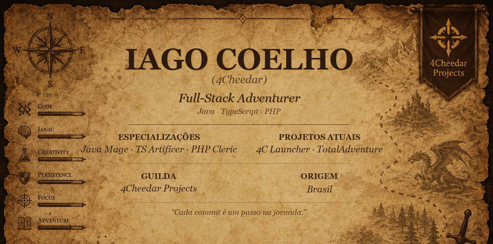
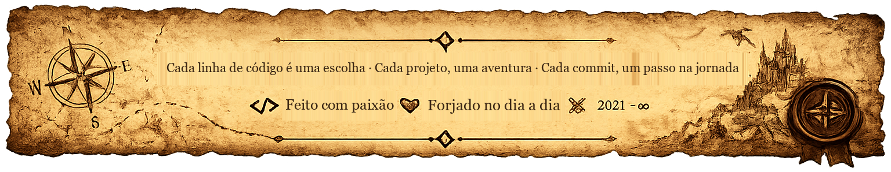

 

`🗺️` [Character Profile](#-character-profile) · [Sobre a Jornada](#-sobre-a-jornada) · [O Mundo — TotalAdventure](#-o-mundo-que-construí--totaladventure) · [O Hub — 4CLauncher](#-o-hub-das-aventuras--4c-launcher) · [Grimório de Plugins](#-grimório-de-plugins--guild-of-code) · [Skill Tree](#-skill-tree) · [Outras Expedições](#-outras-expedições) · [Guild Records](#-guild-records) · [Invocar](#-invocar-o-aventureiro)

✦ ────────────── ✦ ────────────── ✦

## 🧙 Character Profile

**📜 Anotações na margem**

> ❖ Joga tanto quanto programa — Steam, Epic e Battle.net na mochila
>
> ❖ Prefere forjar sistemas próprios a usar solução pronta
>
> ❖ Sempre com algum mundo, app ou bot em construção
>
> ❖ Curte progressão, risco e consequência — dentro e fora do código

✦ ────────────── ✦ ────────────── ✦

## 📜 Sobre a Jornada

Sou o **Iago**, e o resumo da campanha é simples: **gosto de construir coisas do zero e acompanhar de ponta a ponta.** Desenhar a interface, escrever a lógica por trás, montar o banco de dados e cuidar de como aquilo chega até quem vai usar.

Trabalho principalmente com **Java**, **TypeScript/React**, **JavaScript/Node.js** e **PHP**, sempre com algum banco de dados por trás (MySQL, MongoDB, SQLite). Curto desktop apps, automações, bots e sistemas com regra de negócio própria — quando a ferramenta certa não existe do jeito que eu preciso, eu escrevo ela.

✦ ────────────── ✦ ────────────── ✦

## 🌍 O Mundo que Construí — TotalAdventure

**TotalAdventure** é meu servidor de Minecraft (1.20.1), com boa parte da experiência construída do zero por mim, ao invés de depender só de plugins genéricos de loja.

| Sistema | O que acontece |
|---|---|
| ⛏️ **Mineração** | Picaretas com tiers, blocos com vida, minérios que dropam por chance |
| 🔥 **Forja** | Combinar minérios e arriscar no caldeirão — falhou, o item se perde |
| 🧟 **Combate** | Mobs com level, atributos escaláveis e habilidades próprias |
| 💰 **Economia** | Moedas físicas e bancos por vila, com economia regional |

✦ ────────────── ✦ ────────────── ✦

## 🧰 O Hub das Aventuras — 4C Launcher

Se o TotalAdventure é o mundo, o **4C Launcher** é o portal por onde os jogadores entram nele. Um launcher desktop (Windows/Linux) pra baixar, atualizar e abrir modpacks sem dor de cabeça com Java, Forge ou versões.

**Relíquias equipadas no launcher:**

- 🔑 Login **Microsoft (OAuth Device Code)** e modo offline
- 📦 Instâncias isoladas por modpack, com detecção automática de Java/Forge/NeoForge
- ⬇️ Instalação e atualização automáticas via **GitHub Releases**
- 🪶 **Versão Light** pra PCs mais fracos, escolhida direto no card do modpack
- 🧠 Auto-ajuste de memória — usa a RAM ideal sem precisar mexer em nada
- 🟣 **Discord Rich Presence** customizável, com tags dinâmicas por instância
- 🏪 Loja de cosméticos: minere esmeraldas jogando e desbloqueie temas visuais

✦ ────────────── ✦ ────────────── ✦

## 📖 Grimório de Plugins — Guild of Code

O TotalAdventure não roda sozinho. Por trás dele existe uma guilda de plugins Java próprios (namespace `com.plugincheedar`, Spigot API, Maven), cada um cuidando de um pedaço do mundo:

| Relíquia | O que guarda |
|---|---|
| 🧿 `FourCore` | Núcleo — link com Discord, XP, prestígio, cores de chat |
| 🐺 `FourMobs` | Mobs com level e habilidades escaláveis |
| ⚒️ `FourCrafting` | Sistema de crafting customizado |
| 🎒 `FourInventory` | Gerenciamento de inventário |
| 🧑‍🌾 `FourNpcs` | NPCs do mundo — vilas, comércio, missões |
| ⛺ `FourCamping` | Sistema de acampamento e spawn regional |
| 🏦 `FourBanks` | Bancos físicos por vila |
| 🗺️ `FourRegions` | Controle de regiões e territórios |
| ⛏️ `FourCaves` / `FourMining` | Geração de cavernas e mecânicas de mineração |
| 🏪 `FourShop` | Lojas e comércio |
| 💰 `FourCash` / `FourMoney` | Sistema monetário e transações |
| 📈 `FourLevels` | Progressão de nível dos jogadores |

No fundo do cofre também tem relíquias mais antigas — `FourChest`, `FourIslands`, `FourScore`, `FourLimits`, `FourDups`, `FourDaily`, `FourExtra` — de uma fase anterior do projeto, hoje mais esquecidas que ativas.

✦ ────────────── ✦ ────────────── ✦

## 🎒 Skill Tree

**🗡️ Linguagens**

**🛠️ Frameworks & Runtime**

**🗄️ Bancos de Dados**

**🧭 Ferramentas**

✦ ────────────── ✦ ────────────── ✦

## 🗺️ Outras Expedições

| Projeto | Descrição | Stack |
|---|---|---|
| [`Atlanta-FazendeiroGeral`](https://github.com/4Cheedar/Atlanta-FazendeiroGeral) | Bot Discord pra gerenciar fazendas de RP: plantações, rebanho e encomendas | JavaScript |
| [`api-potionMarket`](https://github.com/4Cheedar/api-potionMarket) | API RESTful em Lumen pra um jogo mobile de compra/venda de poções | PHP |

Nos primeiros passos da jornada também ficaram uma loja de estoque em Electron, um template de bot Discord.js e um sistema de pizzaria em Laravel — projetos iniciais, hoje abandonados, mas que ensinaram o caminho até aqui.

✦ ────────────── ✦ ────────────── ✦

## 📊 Guild Records

✦ ────────────── ✦ ────────────── ✦

## 📡 Invocar o Aventureiro

*Sempre aberto pra falar sobre projetos, ideias, ou só trocar figurinha.*

 

